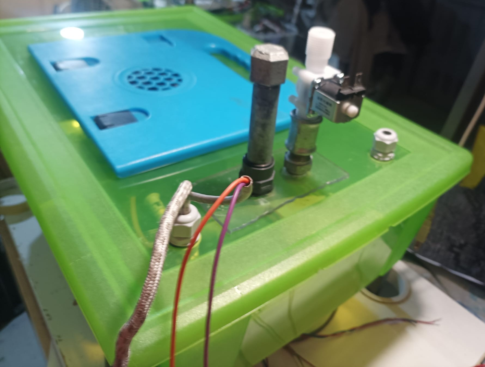
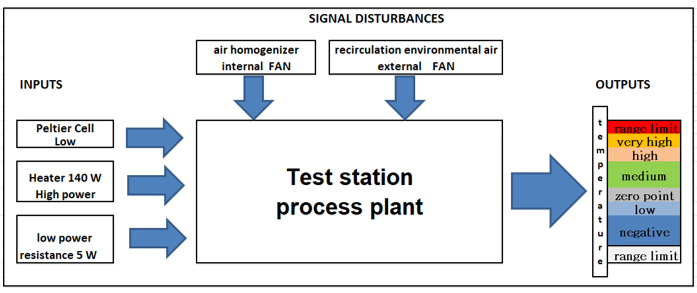
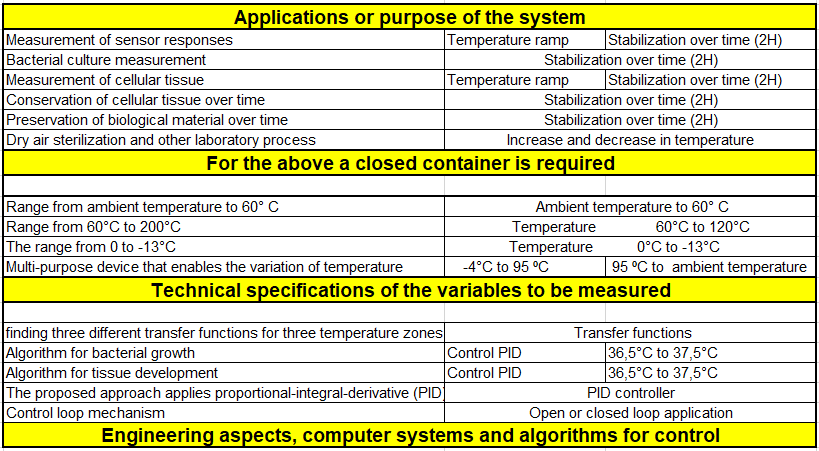

**COPAGETEC**

CALCULATION AND OBTAINING OF PARAMETERS TO GENERATE THERMAL CYCLES USING PID CONTROL IN A NON-PRESSURIZED CLOSED SYSTEM FOR MATERIALS TEST

**Ittalo Pezzotti**
-Institute of Intelligent Industrial Technologies and Systems for Advanced Manufacturing, STIIMA National Research Council of Italy.

-Physics School, National University of Colombia at Medellin, Street 59A # 63-20
*Corresponding author: ittalo.pezzotti@stiima.cnr.it || ifpezzotti@unal.edu.co || 

ABSTRACT
The article's main objective is to show how the necessary parameters are calculated and obtained to build a non-pressurized closed chamber and generate thermal cycles for three temperature zones using a PID controller. The equations, the data table with the calculations, and the transfer functions of the proportional-integral-derivative (PID) control loop mechanism will be described. **The first zone covers the ambient temperature range up to 60°C with an actuator (Rb), another actuator for the range from 60 °C to 200 °C (Ra), and the third actuator (Rc) that covers the range from 0 to -13 °C. This system is based on low-cost technology, and the components can be organized in different configurations according to a specific need or process**. This system will allow students, researchers, and engineers to acquire accurate data and process it in different applications where temperature control is relevant, for example, bacterial growth, biological material preservation, dry air sterilization, and other laboratory processes.
## Authors

- [@ESCOBAR](https://github.com/ittalopezzotti)

## Demo

[Demo](https://github.com/ittalopezzotti/ittalopezzotti.copagetec.github.io)

## Screenshots

## Features

**1.ABSTRACT.**

**2.Introduction.**

**3.Teorical model of the COPAGETEC system.**

**4.Thermal or thermodynamic model.**

**5.Mathematical model of the CCOPAGETEC system.**

**6.Modeling of the actuators and control of the COPAGETEC system.**

**7.CACOTE system control algorithms.**

**8.Methodology.**

**9.Electronic Circuits.**

**10.Firmware.**

**11.Data set.**

## Tech Stack

**Frontend:** HTML, CSS, Javascript

**Client:** Arduino, Platformio, Matlab,Simulink,Sisotools

**Storage:** Indexed DB, Matworks IoT Analytics - ThingSpeak DB, PostgreSQL 

**Server:** C++, Django, Python

## Documentation

[Teorical Model](https://ittalopezzotti.github.io/github.io.copagetec.teoricalmodel.github.io/)

[Mathematical model of the CACOTE system](https://ittalopezzotti.github.io/github.io.copagetec.Mathematicalmodel.github.io/)

[Thermal or thermodynamic model](https://ittalopezzotti.github.io/github.io.copagetec.thermalmodel.github.io/)

[system control algorithms](https://ittalopezzotti.github.io/github.io.copagetec.Controlalgorithms.github.io)

[The methodology applied](https://ittalopezzotti.github.io/ittalopezzotti.github.io.copagetec.methodology.github.io/)

[Electrical circuits](https://ittalopezzotti.github.io/.copagetec.repository.elecir)

## Support

For support, email fake@fake.com or join our Slack channel.

## Roadmap

- Additional browser support

- Add more integrations

